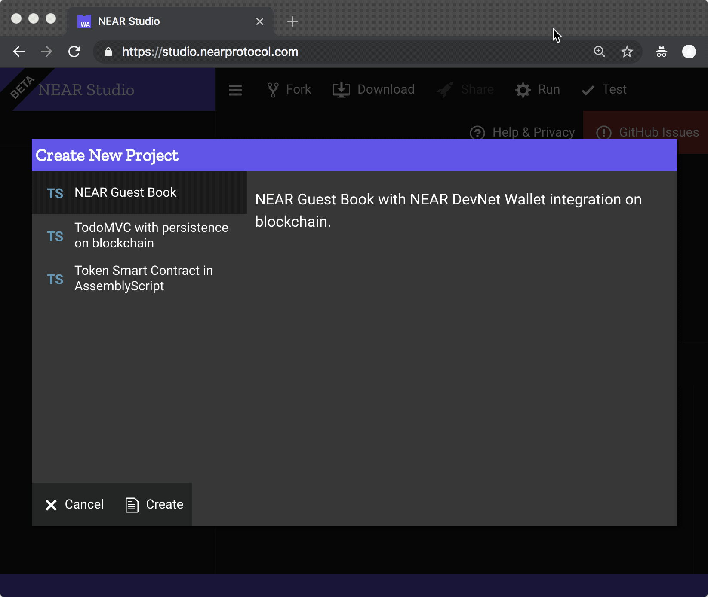

NEAR Studio
====

 [](https://coveralls.io/github/nearprotocol/NEARStudio)

[NEAR Studio](https://studio.nearprotocol.com) is a cloud IDE for development of [NEAR Protocol](https://nearprotocol.com) smart contracts and DApps.

It's heavily based on [WebAssembly Studio](https://webassembly.studio).


[](https://studio.nearprotocol.com)

Running your own local copy of the website
===

To run a local copy, you will need to install node.js and webpack on your computer, then run the following commands:

```
npm install
```

To build NEAR Studio whenever a file changes run:

```
npm run build-watch
```

To start a dev web server run:

```
npm run dev-server
```

Before submitting a pull request run:

```
npm test
```

### Deploying in production

Build for production:
```
npm run build
```

Deploy (need to have `sudo` on `near-studio` server):
```
./deploy.sh
```


### Contributing

If you want to contribute upstream to WebAssemblyStudio, please get familiar with the [contributing guide](https://github.com/wasdk/WebAssemblyStudio/wiki/Contributing).

Join our [Discord](https://discord.gg/gBtUFKR) if you want to help with NEAR-specific stuff or just stay in touch with development progress.

We also have [Telegram](https://t.me/cryptonear) with more curated updates.

### Credits

This project depends on several excellent libraries and tools:

* [WebAssembly Studio](https://github.com/wasdk/WebAssemblyStudio) is used as a skeleton for our IDE.

* [Monaco Editor](https://github.com/Microsoft/monaco-editor) is used for rich text editing, tree views and context menus.

* [WebAssembly Binary Toolkit](https://github.com/WebAssembly/wabt) is used to assemble and disassemble `.wasm` files.

* [Binaryen](https://github.com/WebAssembly/binaryen/) is used to validate and optimize `.wasm` files.

* [Clang Format](https://github.com/tbfleming/cib) is used to format C/C++ files.

* [Cassowary.js](https://github.com/slightlyoff/cassowary.js/) is used to make split panes work.

* [Showdown](https://github.com/showdownjs/showdown) is used to automatically preview `.md` files.

* [Capstone.js](https://alexaltea.github.io/capstone.js/) is used to disassemble `x86` code.

* [AssemblyScript](https://github.com/AssemblyScript/assemblyscript) is used to compile TypeScript smart contracts into WebAssembly.

* [bignum.wasm](https://github.com/MaxGraey/bignum.wasm) Provides big numbers (128-bit and more) implementation for use with AssemblyScript.

* [BigInteger.js](https://github.com/peterolson/BigInteger.js) Provides big numbers (arbitrary length) implementation for use in JS host code for smart contracts.

* LLVM, Rust, Emscripten running server side.

* And of course: React, WebPack, TypeScript and TSLint.
